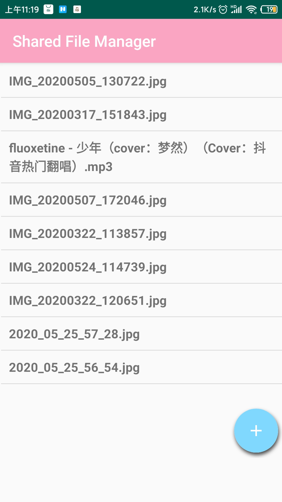
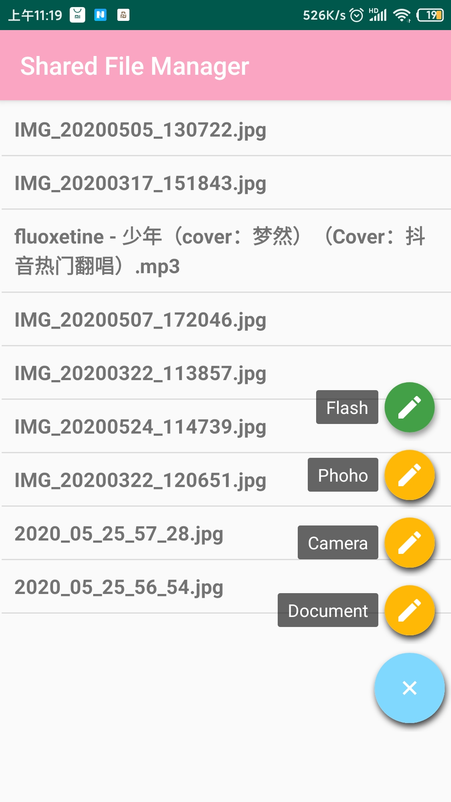
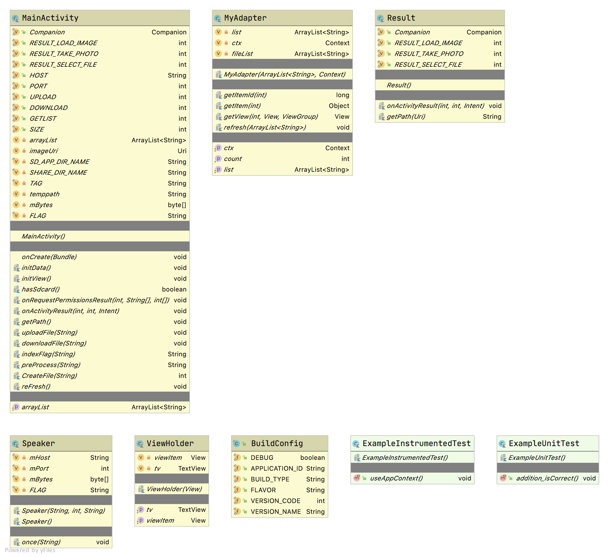

<a id="markdown-设计文档" name="设计文档"></a>
# 设计文档

<!-- TOC -->

- [设计文档](#设计文档)
    - [1. 编写目的](#01-编写目的)
    - [2. 详细设计](#02-详细设计)
        - [2.1. 前端](#021-前端)
        - [2.2. 协议设计](#022-协议设计)
            - [2.2.1. 获取文件列表](#0221-获取文件列表)
        - [2.3. 上传文件](#023-上传文件)
        - [2.4. 下载文件](#024-下载文件)
        - [2.5. 服务器端设计](#025-服务器端设计)
    - [3. 总结](#03-总结)
        - [3.1. 优点](#031-优点)
        - [3.2. 不足](#032-不足)

<!-- /TOC -->

<a id="markdown-01-编写目的" name="01-编写目的"></a>
## 1. 编写目的

本选题要求你基于Socket（不要使用他人已经封装得很好的网络框架），设计一个网络文件共享系统，其主要需求描述如下：

本系统中拥有一个中心文件服务器，系统的所有用户都可以向这个中心文件服务器上传文件，也能查询当前文件清单，从中选择文件下载。

本系统中的文件服务器使用Kotlin实现，客户端是Android App

客户端与文件服务器之间的通讯协议自定（可以参考FTP协议）

实现以下两个核心功能

1. 客户端可以上传文件到服务器上

2. 客户端可以获取文件列表，从中选择文件下载

3. 服务端支持统计功能，比如当前某文件己下载次数，最受欢迎的电影等等

4. 从服务器端可以查看下载次数和最受欢迎文件

<a id="markdown-02-详细设计" name="02-详细设计"></a>
## 2. 详细设计

<a id="markdown-021-前端" name="021-前端"></a>
### 2.1. 前端

app界面如下图所示





前端UML如下所示


安卓界面的主类

```kotlin
class MainActivity : AppCompatActivity()
```

onCreat方法用于生成app的主界面

```kotlin
override fun onCreate(savedInstanceState: Bundle?)
```

创建一个ListView用于显示从服务器端获取的文件列表，

```kotlin
class MyAdapter(var list: ArrayList<String>, var ctx: Context) : BaseAdapter()
```

通过initView从服务器端获取文件列表，并填充在ListView中

```kotlin
private fun initView()
```

检测是否获取的了相关权限，如果没有获得就弹出窗口让用户提供权限

```kotlin
override fun onRequestPermissionsResult()
```

启动相关系统应用，如打开相册，打开相机，打开文件管理器后的相关操作

```kotlin
override fun onActivityResult(requestCode: Int, resultCode: Int, data: Intent?)
```

获取服务器端文件列表

```kotlin
private fun getPath()
```

上传文件，需要提供文件的绝对地址

```kotlin
private fun uploadFile(Data: String)
```

下载文件到手机的sharefile文件夹中，需要从文件列表中提供文件名

```kotlin
private fun downloadFile(fileName: String)
```

刷新文件列表，在上传后自动刷新，或者通过刷新按钮自己刷新

```kotlin
private fun reFresh()
```

因为在通过socket传输字节时，并不会自己截断，所以，我们设置了自己的协议，在每个字符串传输的结尾都加上一个FLAG标志，在传输和接收时都要做相应的处理

```kotlin
private fun indexFlag(string: String): String
private fun preProcess(string: String): String 
```

<a id="markdown-022-协议设计" name="022-协议设计"></a>
### 2.2. 协议设计

在socket的基础上，我们设计了自己的协议，在传输过程中，客户端先发送一个标志位，0代表获取文件列表，1代表上传文件，2代表下载文件。具体的过程如下图所示

<a id="markdown-0221-获取文件列表" name="0221-获取文件列表"></a>
#### 2.2.1. 获取文件列表


<a id="markdown-023-上传文件" name="023-上传文件"></a>
### 2.3. 上传文件


<a id="markdown-024-下载文件" name="024-下载文件"></a>
### 2.4. 下载文件


<a id="markdown-025-服务器端设计" name="025-服务器端设计"></a>
### 2.5. 服务器端设计

服务器端的设计也是使用Kotlin实现的，使用了SocketServer，循环监听，后端的主要是对接收到不同的标志位进行不同的操作，并没有很复杂的设计，这里就不做过多的介绍。

<a id="markdown-03-总结" name="03-总结"></a>
## 3. 总结

<a id="markdown-031-优点" name="031-优点"></a>
### 3.1. 优点

1. 实现了有一个美观界面的安卓端手机app
2. 探索了实现一些动态的控件
3. 上传和下载能够很稳定
4. 增加了统计文件的下载次数的功能
5. 学习了新语言Kotlin在安卓中的应用，体验了该语言在安卓总的新特性

<a id="markdown-032-不足" name="032-不足"></a>
### 3.2. 不足

1. 对于安卓的界面设计不是很熟练
2. app中不支持直接点击文件就打开的功能
3. 对于断点续传功能没有实现
4. 没有实现动态的ip传输，在此基础上还有改进的地方
